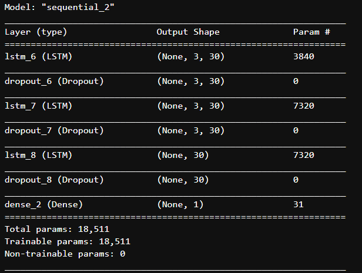
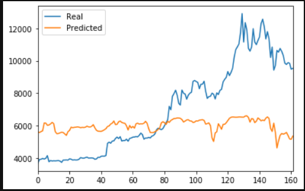
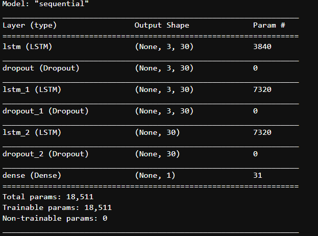
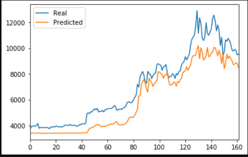

#  Unit 14—LSTM Stock Predictor¶
## LSTM Stock Predictor Using FNG

### Model Parameters
window_size = 3

number_units = 30

dropout_fraction = 0.2

epoch_number = 100

### model.summary

### Model Performance
loss: 0.1387

0.08446212775177425

### real vs predicted values as a line chart

## LSTM Stock Predictor Using Closing Prices

### Model Parameters
window_size = 3

number_units = 30

dropout_fraction = 0.2

epoch_number = 100

### model.summary

### Model Performance
loss: 0.0111

0.014108412289693032
### real vs predicted values as a line chart

### Evaluate the performance of each model
1) Which model has a lower loss? Closing Prices

2) Which model tracks the actual values better over time? Closing Prices

3) Which window size works best for the model? I found a window size of 3 would work best for both models. 

